# **Project Overview**

[DaRianna Creative](https://darianna-creative-29127b71c835.herokuapp.com/) is a fictional website created for educational purposes as part of the Code Institute 4_P course's Milestone Project 4. It is a full-stack website that focuses on using HTML, CSS, Python, Django, and relational database technologies. The website presents the photographer's portfolio, provides headshot services, facilitates fine art print purchases, and offers valuable insights to enhance photo sessions. <br>
 

 
<br>

# Table of contents
* [Project Overview](#project-overview)
    * [Table of contents](#table-of-contents)
* [Project Planning](#project-planning)
    * [Target Audiences](#target-audiences)
    * [Website business goals](#website-business-goals)
    * [User Stories](#user-stories)
    * [Agile development](#agile-development)
    * [Minimally viable product (MVP) for the project submission](#minimally-viable-product-mvp-for-the-project-submission)
* [Project Planning](#)

## Project Planning

### Target Audiences
<br>
The intended audience spans a wide spectrum of individuals and businesses, encompassing portrait photography enthusiasts, art collectors, and both novice and experienced photographers aiming to enhance their skills. Specifically for photography sessions, the focus is on actors in need of professional headshots, as well as individuals seeking updated profile photos.
<br>

### Website business goals
- Increase Sales of Fine Art Prints:
    - Drive traffic to the website to showcase the photographer's fine art prints.
    - Implement effective marketing strategies to attract potential buyers.
    - Optimize the website's user experience to encourage visitors to make purchases.
- Promote Headshot and Photo Session Services:
    - Highlight the photographer's headshot and photo session services on the website.
    - Provide detailed information about the services offered, including packages, pricing, and examples of previous work.
    - Encourage visitors to book sessions by showcasing the benefits and value of professional photography services.
- Build Customer Relationships:
    - Offer personalized experiences for registered users through account dashboards.
    - Provide regular updates and notifications to keep users informed about new prints, special offers, and upcoming photo sessions.
    - Foster engagement and loyalty by offering exclusive content, such as photography tips and behind-the-scenes insights.
- Enhance User Engagement and Experience:
    - Create an engaging and visually appealing website design to captivate visitors.
    - Provide interactive features like galleries and sliders to showcase fine art prints and photography services.
    - Offer valuable resources and educational content, such as tips during a photoshoot, to help users improve their photography skills.
- Expand Customer Base:
    - Implement social media integration to reach a wider audience and drive traffic to the website.
    - Encourage satisfied customers to share their experiences and recommend the photographer's services to others.
    - Explore partnerships or collaborations with other businesses or influencers to increase visibility and attract new customers.
- Streamline Business Operations:
    - Utilize a comprehensive content management system to manage fine art prints, headshot packages, and photo session options.
    - Implement efficient processes for managing user accounts, including registrations, approvals, and inquiries.
    Use analytics and reporting tools to track website performance, monitor sales trends, and make data-driven decisions to optimize business operations.

### User Stories

| Issue ID | User Story |
|----------|------------|
| [#1](https://github.com/AleksandrAtr/darianna-creative/issues/1) | As a first-time visitor, I want to browse a gallery of fine art prints available for purchase to explore the artistic offerings of the photographer. |
| [#2](https://github.com/AleksandrAtr/darianna-creative/issues/2) | As a first-time visitor, I want to browse a gallery of fine art prints available for purchase, categorized by themes or genres. |
| [#3](https://github.com/AleksandrAtr/darianna-creative/issues/3) | As a first-time visitor, I want to view detailed information about each fine art print, including high-resolution images, descriptions, dimensions, and pricing, to make informed purchasing decisions. |
| [#4](https://github.com/AleksandrAtr/darianna-creative/issues/4) | As a first-time visitor, I want to learn about the headshot services offered by the photographer, including packages available, pricing, and examples of previous work, to assess their suitability for my needs. |
| [#5](https://github.com/AleksandrAtr/darianna-creative/issues/5) | As a first-time visitor, I want to easily register for an account on the website, with a straightforward and intuitive process, to access additional features and benefits. |
| [#6](https://github.com/AleksandrAtr/darianna-creative/issues/6) | As a registered user, I want a personalized account dashboard where I can manage my profile information including deleting the account. |
| [#7](https://github.com/AleksandrAtr/darianna-creative/issues/7) | As a registered user, I want access exclusive content to enhance my overall experience on the website. |
| [#8](https://github.com/AleksandrAtr/darianna-creative/issues/8) | As a registered user, I want view order history. |
| [#9](https://github.com/AleksandrAtr/darianna-creative/issues/9) | As a registered user, I want to save favourite prints for easy access in the future. |
| [#10](https://github.com/AleksandrAtr/darianna-creative/issues/10) | As a registered user, I want to access the website's scheduling feature to view the available time slots for headshot sessions. |
| [#11](https://github.com/AleksandrAtr/darianna-creative/issues/11) | As a registered user, my goal is to seamlessly book a photo session by completing an online payment. |
| [#12](https://github.com/AleksandrAtr/darianna-creative/issues/12) | As a registered user, I aim to purchase fine art prints conveniently by completing an online payment. |
| [#13](https://github.com/AleksandrAtr/darianna-creative/issues/13) | As a registered user, I want to receive regular updates and notifications about new fine art prints, special offers, and upcoming photo sessions to stay informed about the photographer's latest offerings and promotions. |
| [#14](https://github.com/AleksandrAtr/darianna-creative/issues/14) | As a first-time user, I aim to purchase fine art prints conveniently by completing an online payment. |
| [#15](https://github.com/AleksandrAtr/darianna-creative/issues/15) | As a first-time visitor, I want to access the website's scheduling feature to view the time slots for headshot sessions. |
| [#16](https://github.com/AleksandrAtr/darianna-creative/issues/16) | As a registered user, my goal is to seamlessly book a photo session by completing an online payment. |
| [#17](https://github.com/AleksandrAtr/darianna-creative/issues/17) | As an admin, I want to have access to a comprehensive content management system where I can easily add, edit, or remove fine art prints, headshot packages, and photo session options, to keep the website's offerings up-to-date and relevant. |
| [#18](https://github.com/AleksandrAtr/darianna-creative/issues/18) | As an admin, I want to be able to manage user accounts, including approving registrations, updating account status, and addressing any user inquiries or issues, to ensure a smooth and efficient user experience. |
| [#19](https://github.com/AleksandrAtr/darianna-creative/issues/19) | As an admin, I want to have access to analytics and reporting tools to track website traffic, user engagement, sales performance, and other key metrics, to make informed decisions and optimize the website's performance and offerings. |
| [#20](https://github.com/AleksandrAtr/darianna-creative/issues/20) | As a first-time visitor, I want to easily discover the services or products offered on the website. |


### Agile development
User stories have been created in the GitHub Projects - links to the stories are provided in the [User Stories](#user-stories) table in the Issue ID column. The user stories have been split into categories using the MoSCoW prioritization method -
- Must-have
- Should-have 
- Could-have

The primary goal for the MVP was to concentrate on the development of essential features (Must-have items). The Should-have and Could-have shall be addressed in the future development cycles.

The procedural steps during development were as follows:

1. Transfer a crucial user story from the Sprint Backlog (User Stories) column to the To Do (User Story) column.
1. Based on the user story, generate tasks related to its fulfilment and store them in the To-do (Tasks and Spikes) column. Subsequently, break down each task into sub-tasks and document them on the task card.
1. Prepare multiple tasks and initiate their implementation. The one currently in progress is shifted to the In Progress (Tasks and Spikes) column. Mark off completed sub-tasks and document any issues or progress comments.
1. Upon task completion, relocate it to the Done (Tasks and Spikes) column and close it, providing comments if necessary.
1. Once all tasks associated with the user story are finished, move the user story to the Done (User Stories) column, including any pertinent comments.
1. Repeat the process until the project phase completion. 

This methodology centred on developing essential features first, enabling flexibility, and allowing incremental development. The approach incorporated transparent progress tracking through visual boards and early identification of issues. 

The details of the user stories and associated priority labels can be found in [Projects](https://github.com/users/AleksandrAtr/projects/7/views/1?layout=board).

## Minimally viable product (MVP) for the project submission

### Unregistered users
- About page 
- Headshots page: Display available-for-sale photography packages
- Artsale page: Display available-for-sale fine art prints
- Workshops page: Display available-for-sale workshop packages
- Login page
- Register page

### Registered users
- All of the above
- Blog page


## Wireframes
### High level website design desktop - 
<br>
 

<br>


<br>


<br>

<br>

<br>

<br>

<br>

<br>


### High-level website design for mobile - 

<br>

### High-level webpage flow chart - 

<br>

## Database Schema

During the planning phase, I developed a database schema to efficiently organize my data, aligning with the website's business goals and user stories. The schema underwent slight modifications during development. Below is the final version represented in the high-level database schema diagram.


### Future Improvements

For future implementations, consider the "Should Have" and "Could Have" items outlined in the User Stories on the GitHub Projects board. These tasks were not completed before the Code Institute project submission deadline but incorporating them will significantly enhance the overall customer experience. Explore the Agile Development section for more details and refer directly to the user stories on [GitHub Projects](https://github.com/users/AleksandrAtr/projects/7/views/1?layout=board).

Additionally, it is suggested to include the following enhancements:

- **Headshots Portfolio:** Integrate a portfolio section showcasing the business's headshots photography portfolio to provide users with a comprehensive overview of the photographer's work.
- **Prints Size Cost Functionality:** Develop functionality to adjust pricing based on the size of fine art prints, offering customers flexibility and customization options.
- **CRUD for Blog Posts:** Implement Create, Read, Update, and Delete functionality for blog posts, allowing the business to publish and manage articles effectively.
  
These enhancements are discussed further in the [Website Main Features](#main-website-features) section below.


## Website colour palette
The website embraces a sleek and minimalist colour palette, primarily featuring black and white hues and shades of grey. This monochromatic scheme enhances the site's modern and creative vibe, presenting a refined and polished aesthetic. The simplicity of the colour scheme directs attention to the content and visuals, resulting in a cohesive and visually appealing user experience.


## Typography

The website features "Roboto Mono," designed by [Google](https://fonts.google.com/specimen/Roboto+Mono/about). Roboto Mono expands the Roboto-type family with a monospaced variant. Similar to other fonts within the Roboto family, it's specifically designed for enhanced readability on screens across various devices and reading conditions. It is stylish and elegant and was chosen for its clean and modern appearance, which complements the website's overall aesthetic.


# Main Website Features

At the MVP stage, the website offers two layouts:

- **For Users Not Logged In:**
  - Access to About, Headshots, Artsale, Workshops.
  - Membership: Register and Login options.

- **For Logged-In Users:**
  - Access to About, Headshots, Artsale, Workshops, Blog.
  - Membership: My Profile and Logout.
  - Additional access for Admin: Product Administration.

Unregistered users can easily create new accounts by signing up.

Registered users enjoy additional features, including:
- Adding, editing, or deleting product reviews.
- Updating or saving profile information (including address for future orders).
- Viewing order history.
- Reading the blog.

Both registered and unregistered users have the ability to purchase the products offered.

Consistency is maintained across pages with:
- **Navigation Bar:** Enables seamless navigation across the website.
- **Main Content Section** Varies on pages and described below.
- **Footer:** Concludes the home page, offering a space for additional information and relevant links.

### Navigation bar mobile view bag empty
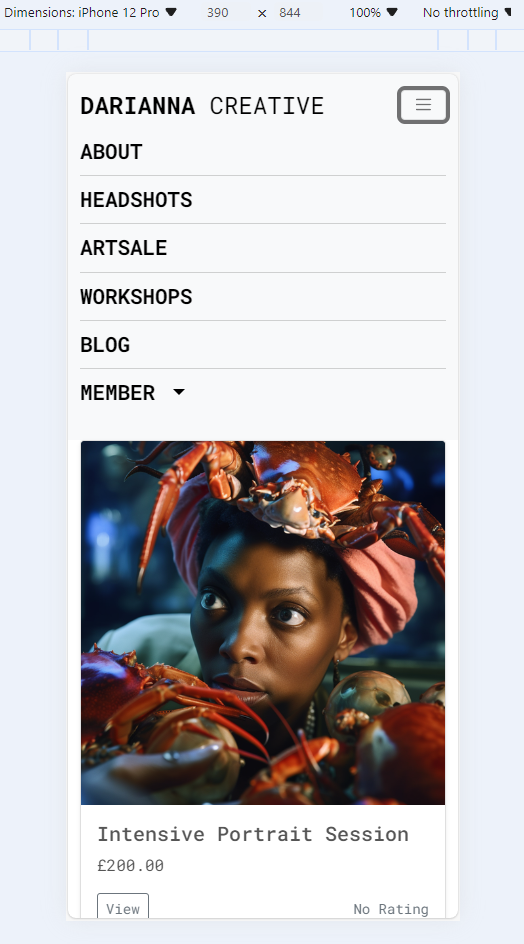
### Navigation bar desktop view bag empty
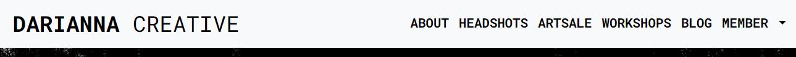

### Navigation bar mobile view bag not empty
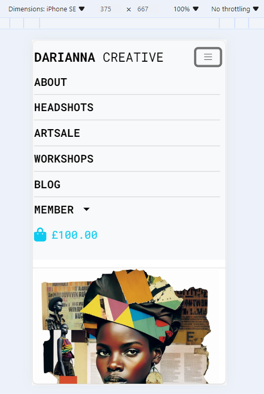
### Navigation bar desktop view bag not empty
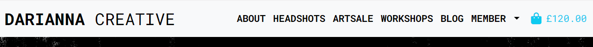


The website's design is responsive, ensuring usability across various screen sizes.

### Products Sale

The website includes pages for Headshots, Artsale, and Workshops, each offering various products displayed similarly. Products are presented in card format, showcasing an image, name, price, and rating, with a View button for more details. The detailed product page provides additional information, including reviews.

### Products Review

Registered users can add, edit, or delete reviews on the product detail page. Admins can also delete reviews from others.

### CRUD

Users have CRUD functionality for reviews based on their registration status.

### Payments

Payments are facilitated through [Stripe](https://stripe.com/gb), ensuring secure transactions.

## About Page Overview
The About page serves as the Home page or landing page. It's designed to welcome users with easy navigation and essential information. It includes a straightforward menu for moving around the site and a header that captures visitors' attention, setting the tone for the site's content and information about the business. The footer at the bottom of the page has space for extra details like contact information or useful links. 

### Key Components of the main section:
- **Hero Image:** Engages users with visually compelling content.
- **Additional Site Information Section:** Invites users to register and provides a link to the signup page.

### Mobile view
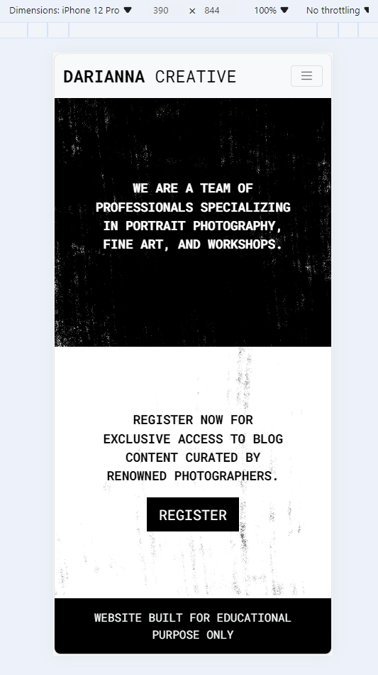
### Desktop view
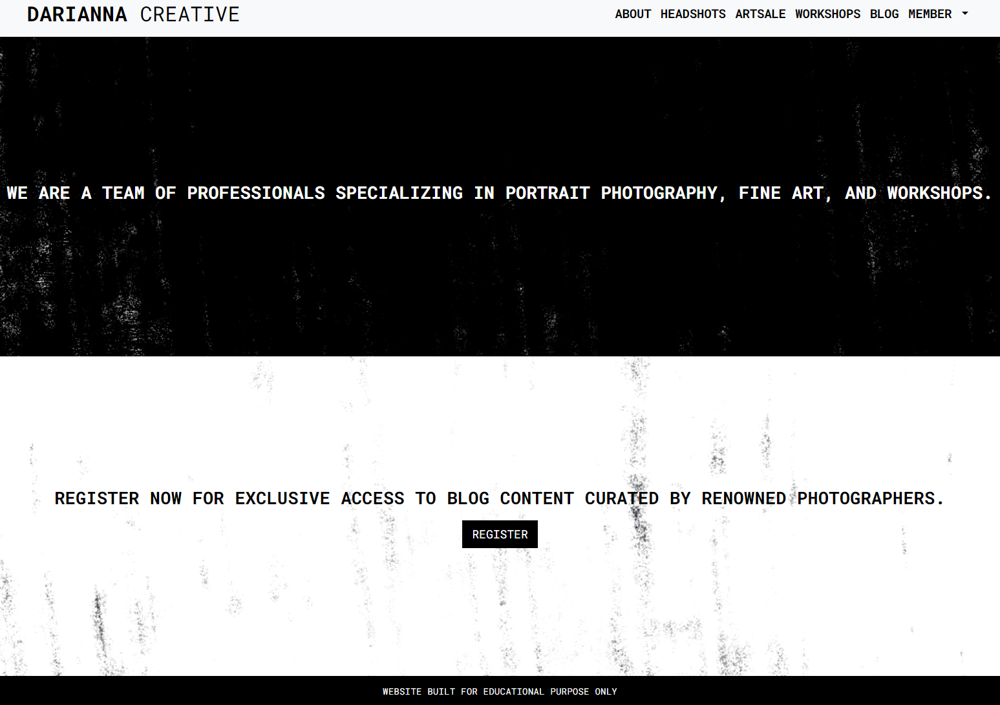

## Headshots Page
The Headshots page showcases Portrait photography packages. It provides a seamless user experience with intuitive navigation. Each product listing displays the package name, price, and rating, allowing visitors to evaluate the offerings quickly. The page layout reflects the business's professionalism and invites potential customers to explore further.

The original plan included adding Portfolio photographs alongside the products for sale, but this feature was postponed due to time constraints and is suggested for future improvements.

### Key Components of the main section:
- **Product Display:** Offers details of the product range and a button for accessing detailed views.

### Mobile view
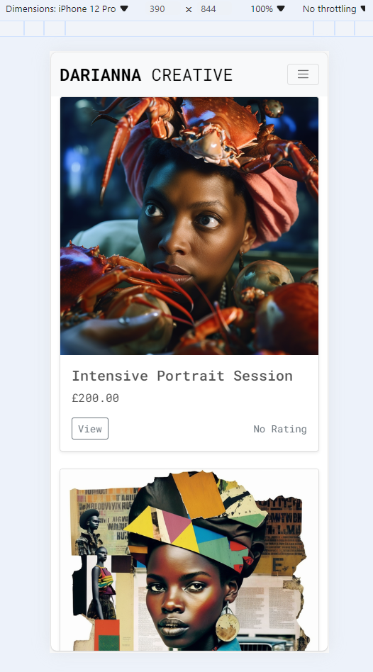
### Desktop view
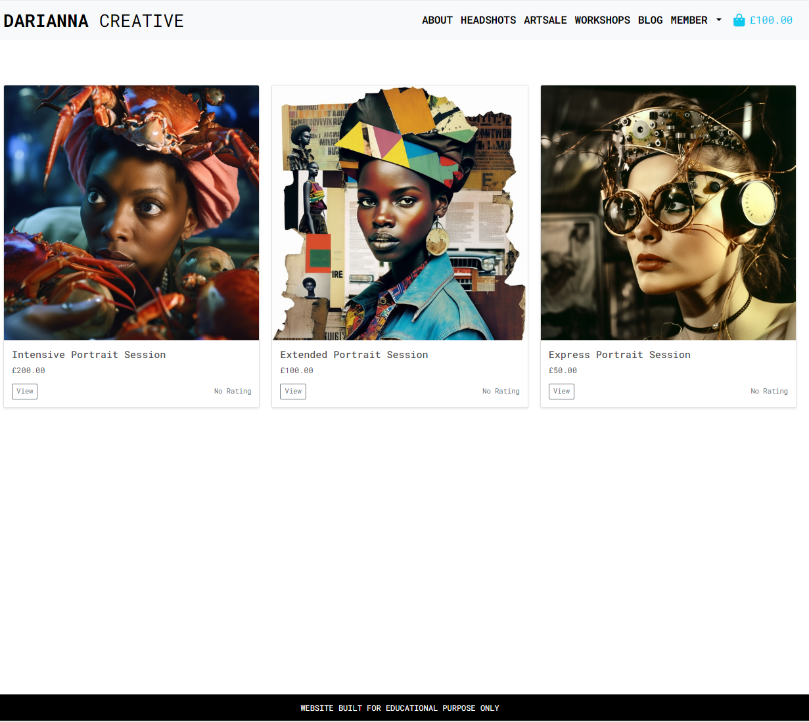

## Artsale Page

The Artsale page features a collection of fine art prints, allowing users to explore and purchase unique artworks. Like other product pages, each item is presented in card format, showcasing its name, price, rating, and size. Users can quickly assess the available prints and navigate to detailed views for more information.

The fine art prints on the Artsale page differ from other products such as Headshots and Workshops due to their varying sizes. While the intention was to implement different pricing based on print size, this feature was not prioritized due to time constraints. However, it is suggested for future improvements to enhance the flexibility and customization options for customers.

### Key Components of the main section:

- **Product Display:** Presents a curated selection of fine art prints, highlighting their unique characteristics and inviting users to explore further.
- **Product search:** Allows users to search for fine art prints based on title and content.


### Mobile view
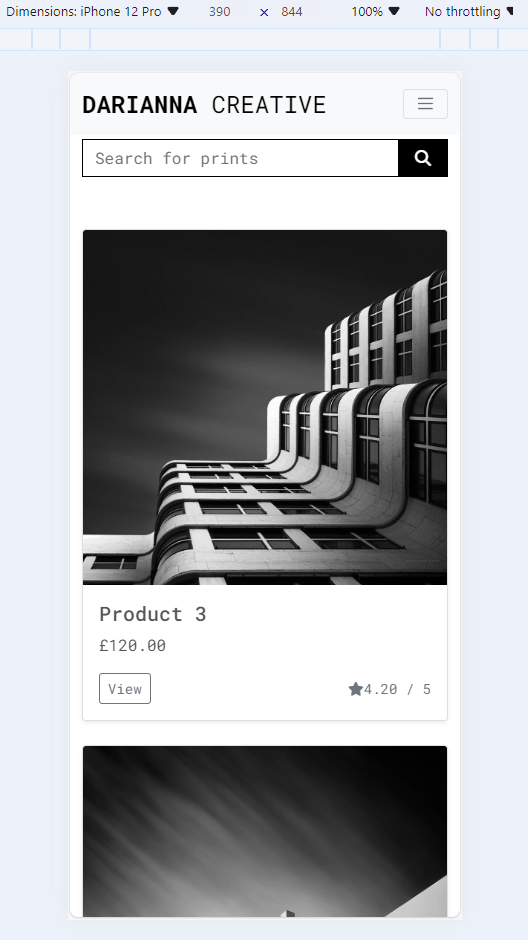
### Desktop view
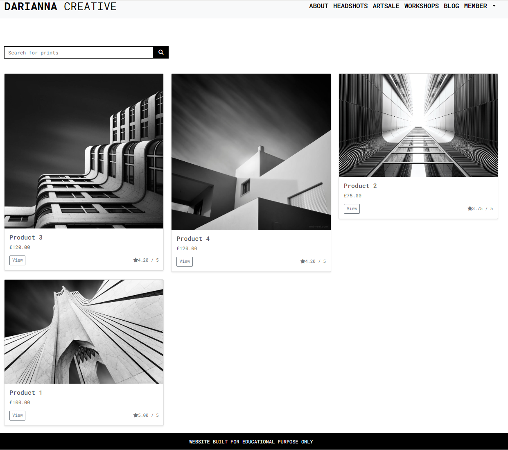


## Workshops Page

The Workshops page showcases a selection of portrait photography workshops offered by the business. Each workshop is presented in card format, displaying its name, price, rating, and other relevant details. Users can easily browse through the available workshops and access detailed views for more information.

The workshops featured on this page are tailored for portrait photography enthusiasts and professionals. While the initial plan included offering different workshop packages with varying content and durations, this feature was not implemented due to time constraints. It is recommended for future improvements to expand the workshop offerings and provide more options for users.

### Key Components of the main section:

- **Workshop Display:** Highlights the various portrait photography workshops available, providing users with insights into the content and objectives of each workshop.

### Mobile view
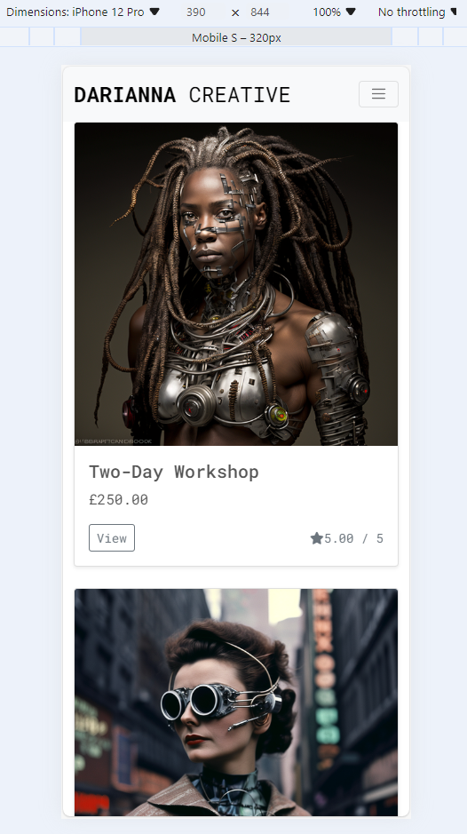
### Desktop view
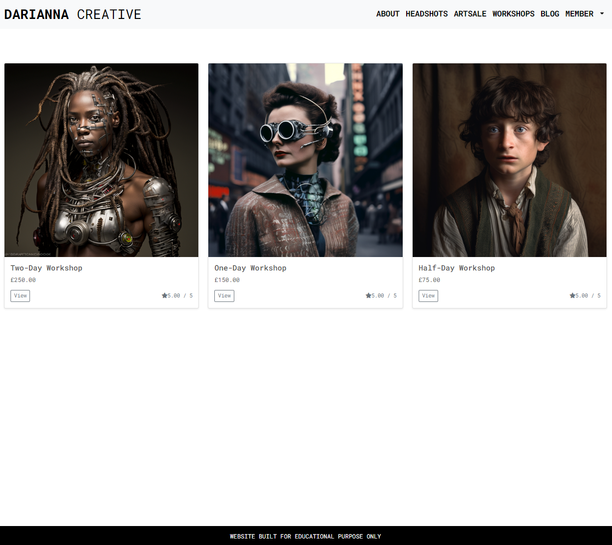

## Blog Page

The Blog page is designed to serve as a platform for the business to share informative articles with its audience. It offers valuable insights, tips, and information related to the website's niche. Initially, there were plans to implement CRUD functionality for the superuser to manage the blog content. However, due to time constraints, this feature was not prioritized and is suggested for future improvements.

### Key Components of the main section:

- **Article Display:** Provides access to a collection of informative articles, covering topics relevant to the website's audience.

### Mobile view
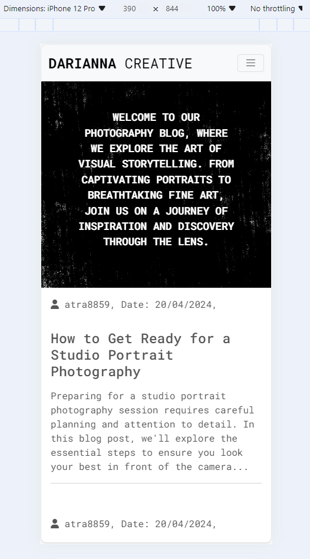
### Desktop view
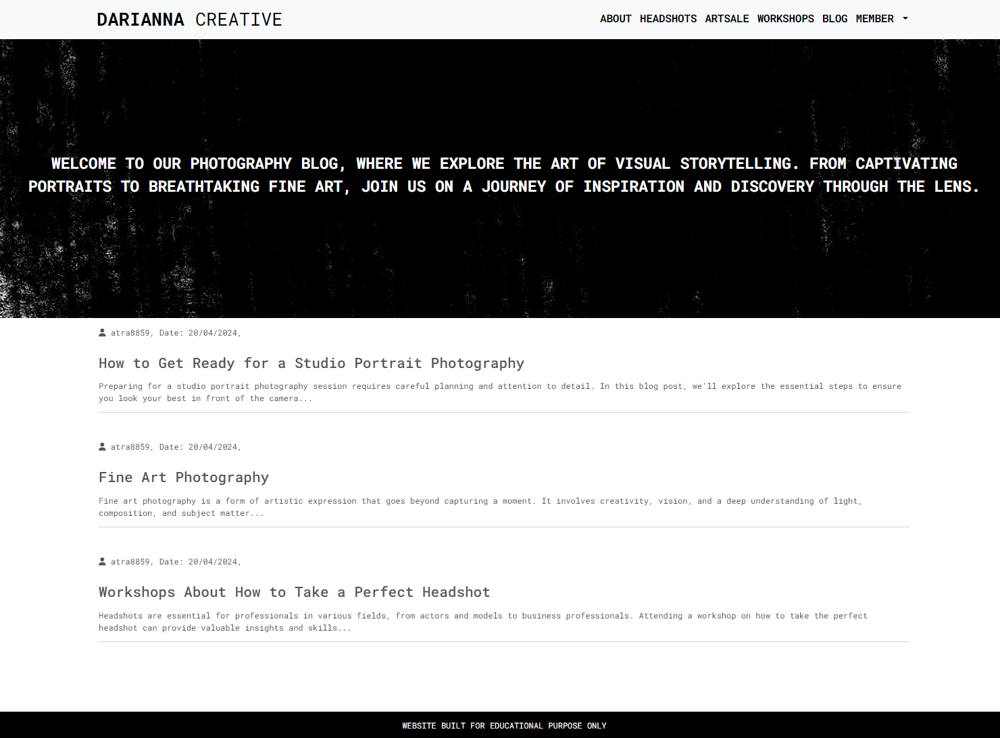

## Profile Page

The Profile page empowers users to manage their account details efficiently. It offers functionality for users to update their shipping information and view their order history. By providing access to these features, the Profile page enhances the user experience by allowing customers to maintain accurate information and track their past orders effectively.

### Key Components of the main section:

- **Shipping Information Update:** Enables users to modify their shipping details, ensuring accurate delivery of orders.
- **Order History:** Displays a comprehensive record of past orders, allowing users to track their purchasing history and manage their transactions efficiently.

### Mobile view
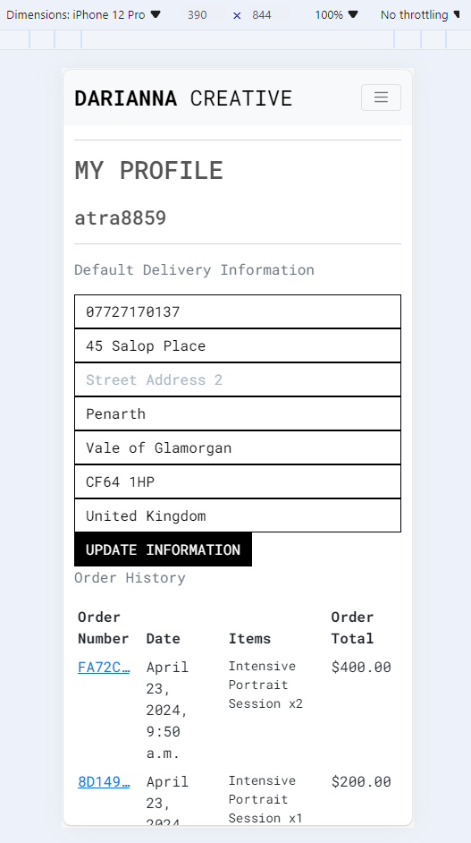
### Desktop view
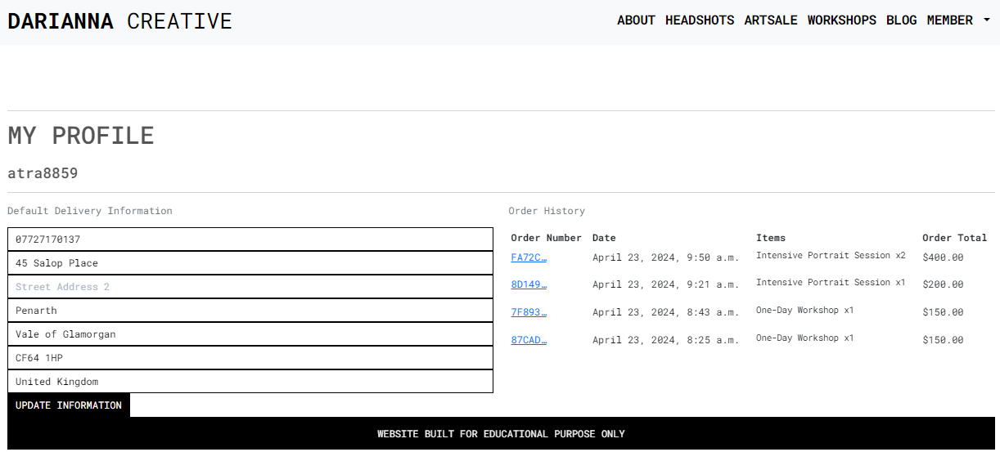

## Bag Page

The Bag page offers users a convenient overview of their ordered products and allows them to manage their selections easily. Users can review the products in their bag, adjust quantities, or remove items as needed. Additionally, the page provides intuitive navigation options, such as links to Keep Shopping or proceed to Checkout, streamlining the user's shopping experience.

### Key Components of the main section:

- **Product Review:** Users can review the products in their bag, ensuring accuracy before proceeding to checkout.
- **Quantity Adjustment:** Allows users to modify the quantity of individual items in their bag according to their preferences.
- **Item Removal:** Provides the option to remove unwanted items from the bag, allowing users to refine their selections effortlessly.
- **Navigation Links:** Offers convenient links to Keep Shopping, enabling users to continue browsing, or Checkout, facilitating a seamless transition to the payment process.

### Mobile view
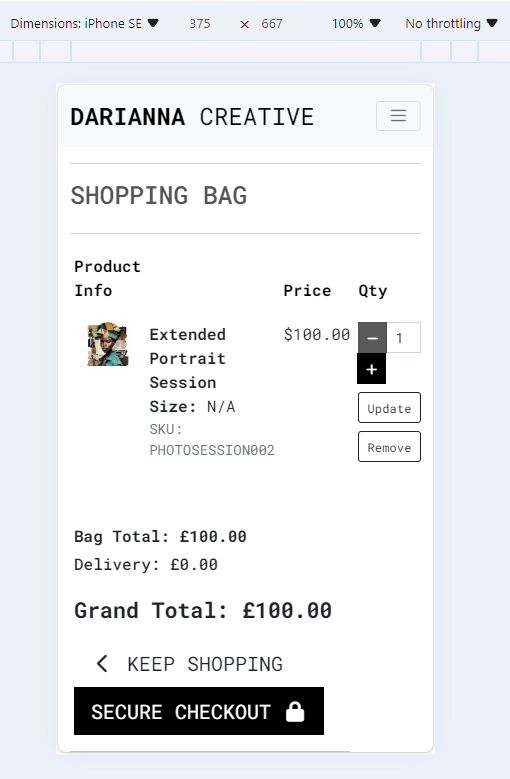
### Desktop view
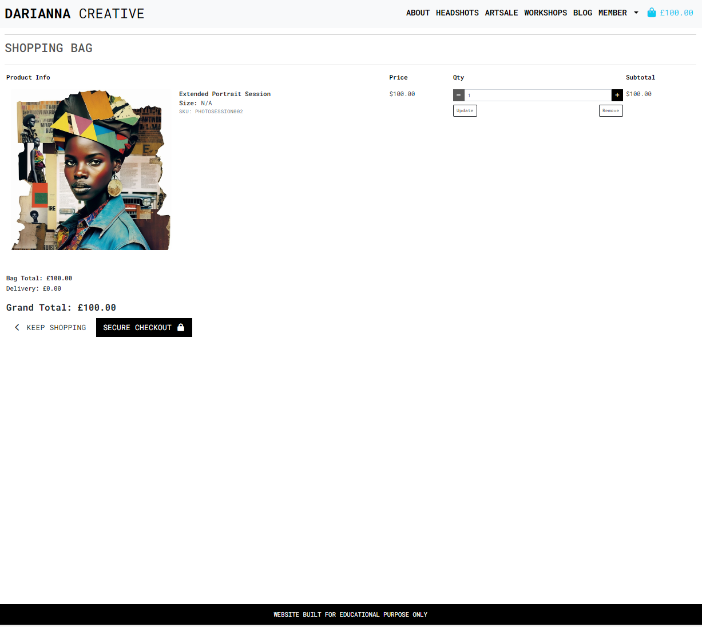

## Checkout Page

The Checkout page streamlines the purchasing process by providing users with a comprehensive overview of their selected products, including prices and total costs. Additionally, users can enter their shipping address and payment details via input forms conveniently located on the page. Once all necessary information is provided, users can submit their order seamlessly.

### Key Components of the main section:

- **Product Overview:** Displays a detailed summary of the selected products for purchase, including individual prices and the total cost.
- **Shipping Address Input:** Allows users to enter their shipping address directly on the Checkout page, ensuring accurate delivery.
- **Payment Details:** Provides input forms for users to input their card details securely, facilitating payment processing.
- **Order Submission:** Enables users to submit their order directly from the Checkout page, completing the purchasing process efficiently.
- **Navigation Link:** Offers a link to return to the Bag page, allowing users to adjust their product selections if needed before finalizing their order.

### Mobile view
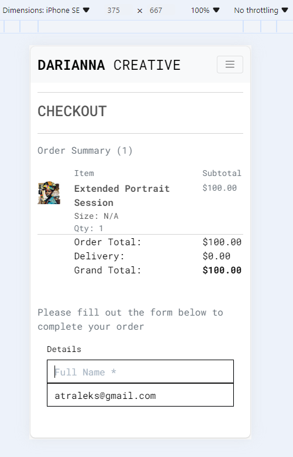
### Desktop view
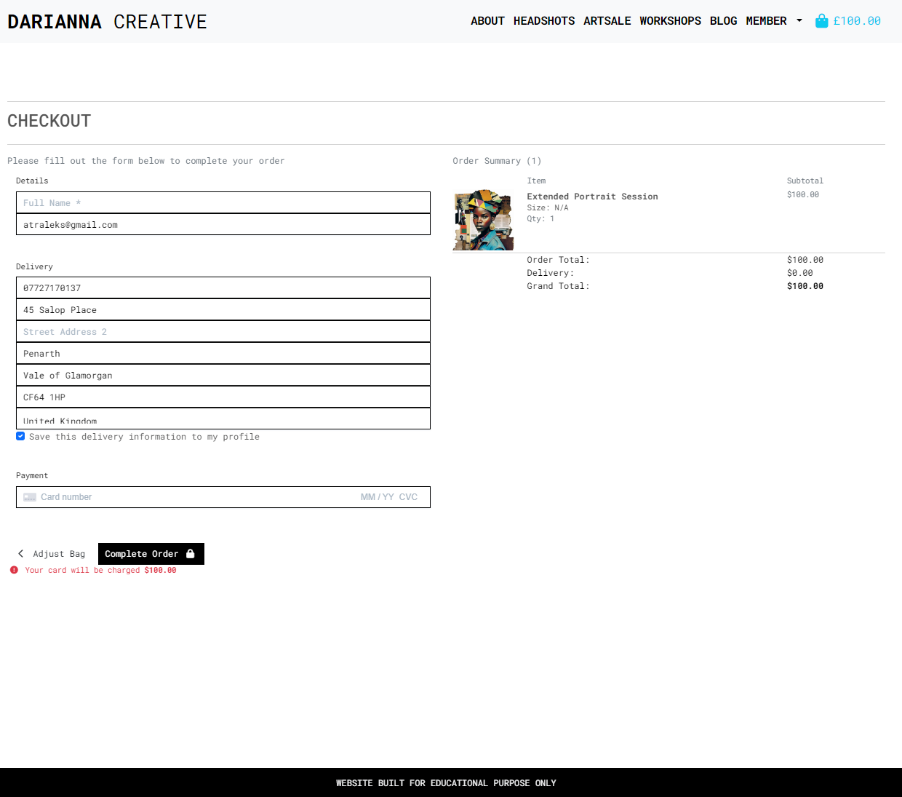

### Product Administration Page

The Product Administration page is designed for superusers or administrators to manage products on the website. This page provides a user-friendly interface with form input fields where product details can be entered, including the product name, description, price, and other relevant information. Additionally, users have the option to upload an image for the product, enhancing the visual presentation. By utilizing this page, administrators can efficiently add new products to the website and ensure an up-to-date and comprehensive product catalog.

#### Key Features:
- **Form Input Fields:** Allows administrators to enter product details such as name, description, and price.
- **Image Upload:** Enables administrators to upload images to accompany product listings, enhancing visual appeal.


### Mobile view
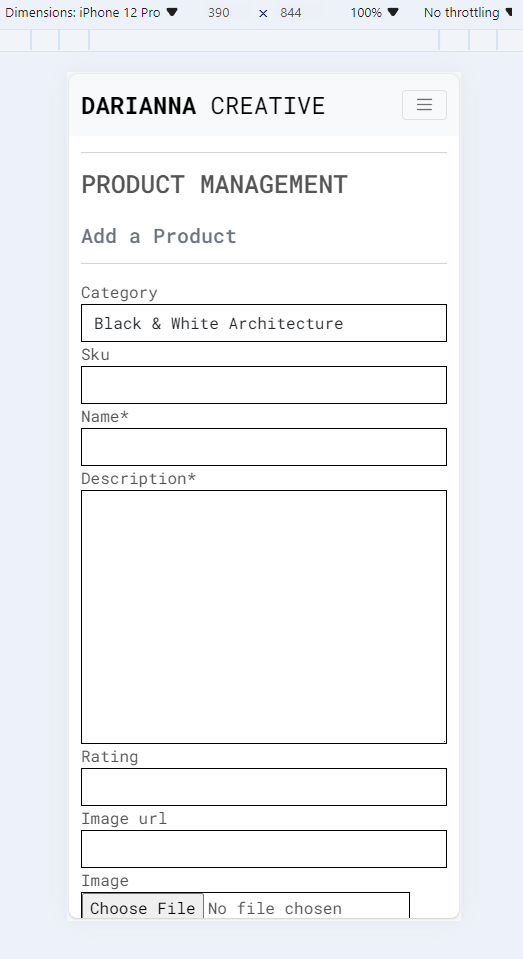
### Desktop view
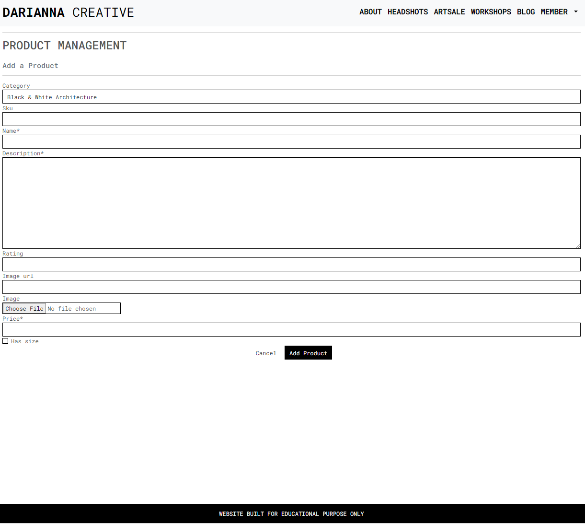

# Technologies Used

### Languages
- **HTML:** Used to build the main structure of the site.
- **CSS:** Utilized for styling the website, incorporating bespoke styling and Bootstrap.
- **JavaScript:** Implemented for front-end interactive features, including bag/product quantity input, Stripe payment handling etc.

### Backend Modules / Packages & Frameworks
- **Python:** Utilized to build the core of the backend within the Django framework.
- **Django:** High-level Python-based Web Framework.
- **AllAuth:** Integrated Django authentication & sign in.
- **Django Countries:** Provided country choices for forms.
- **Django Widget Tweaks:** Offered advanced styling & customization for Django form fields.
- **Django Storages:** Provided custom storage backends for Django.
- **Freezegun:** Aided automated testing by controlling the datetime module.
- **Gunicorn:** Acted as a Python WSGI HTTP Server for UNIX.
- **Pillow:** Python Imaging Library for extended image handling capabilities.
- **Psycopg2:** Postgres adapter for smooth communication between the backend and the database.
- **s3transfer, Boto3 & Botocore:** Utilized for managing Amazon AWS S3 Transfers.
- **Stripe:** Integrated for secure online payments.
- **dj-database-url:** Allowed the use of DATABASE_URL environment variable in settings.py.
- **Coverage:** Tool for measuring code coverage of Python Programs.
- **oauthlib & requests-oauthlib:** Handled authentication using the OAuth request signin logic.
- **python3-openid:** Supported the use of the OpenID decentralized identity system.
- **sqlparse:** SQL parser for Python.
- **urllib3:** HTTP client for Python.

### Databases
- **SQLite:** Used as the built-in Django database for development.
- **Elephant SQL:** Postgres-based database host, used to host the database for the live production app.

### Frontend Frameworks / Libraries
- **Bootstrap:** Employed throughout the site for styling, layout, and responsiveness.
- **Font Awesome:** Used to add icons to the site for improved UX.
- **jQuery:** JavaScript library for making JavaScript quicker and easier to write.

### Other Tools
- **Git:** Utilized for version control via Code Anywhere, pushing changes to GitHub.
- **GitHub:** Used to store the project code.
- **Heroku:** Cloud-based hosting platform used to deploy the live site.
- **Amazon Web Services:** Hosted static files and images for the live production site.
- **Google Chrome Dev Tools:** Tested and debugged production and live apps.
- **Miro:** Developed wireframes into a full site design, and database schema
- **DrawSQL:** Designed the database schema visually.
- **Favicon.io:** Created and added the favicon to the browser tab.
- **Techsini:** Generated website mockup images.
- **Temp Mail:** Used for testing account verification & order confirmation.


# Testing 
[View Testing Documentation](TESTING.md)

# Deployment

Deployment facilitates the transition of your project from your local environment or IDE to publicly accessible hosting for others to access and enjoy. Below are the detailed steps you'll need to follow. These instructions assume you're using an IDE like VS Code or cloud based GitPod.


- **Hosting Platform:**
   - Heroku -  [https://www.heroku.com](https://www.heroku.com/)

- **Database Hosting:**
   - ElephantSQL (PostgreSQL database) - [https://www.elephantsql.com/](https://www.elephantsql.com/)

- **Static File Hosting:**
   - AWS (Amazon Web Services) - [https://aws.amazon.com/](https://aws.amazon.com//)


### Project Preparation in Your IDE

#### Note: Python Installation Required

Please note that it's assumed Python is installed on the computer or IDE cloud based platform for deploying this project. If you haven't installed Python yet, you'll need to download and install it from the [official Python website](https://www.python.org/downloads/) before proceeding with the deployment process.


1. **Install Required Packages**

Open your IDE and execute the following commands in your terminal:

`pip3 install dj_database_url==0.5.0 psycopg2`


- `dj_database_url` facilitates connecting to various databases using their URL.
- `psycopg2` is a PostgreSQL adapter for Python.

2. **Update Requirements**

Update your `requirements.txt` to include the newly installed packages.

```
pip freeze > requirements.txt
```

3. **Modify `settings.py`**

In your `settings.py`, import `dj_database_url` under the import for `os`.

```
import os
import dj_database_url
```

### Setting up the ElephantSQL Database

Log into ElephantSQL and create database instance.
1. Click on "Create New Instance".
2. Input an instance name.
3. Select the free Tiny Turtle plan.
4. Leave the tags field blank.
5. Select a region closest to you for the data center.
6. Review your instance details and confirm by creating the instance.
7. Copy the URL of the newly created database instance for later use.

### Setting up an Amazon S3 Bucket for Static Website Hosting

This guide will walk you through the process of setting up an Amazon S3 bucket for hosting a static website, including necessary permissions and security configurations using AWS IAM.

**Creating and Configuring the S3 Bucket**

1. **Create an AWS Account**:
   - Sign up or log into your Amazon AWS account.

2. **Create a New S3 Bucket**:
   - Navigate to the S3 service in the AWS Management Console.
   - Click "Create bucket".
   - Provide a unique bucket name and select an appropriate region.
   - Uncheck "Block all public access" under the permissions settings to allow public access.
   - Acknowledge the warning that the bucket will be publicly accessible.

3. **Enable Static Website Hosting**:
   - Go to the "Properties" tab for your bucket.
   - Activate "Static website hosting".
   - Set 'index.html' as the index document.
   - Click "Save".

4. **Configure CORS**:
   - Move to the "Permissions" tab and click on "CORS configuration".
   - Input the following JSON and save:
     ```json
     [
       {
         "AllowedHeaders": ["Authorization"],
         "AllowedMethods": ["GET"],
         "AllowedOrigins": ["*"],
         "ExposeHeaders": []
       }
     ]
     ```

5. **Set Up Bucket Policy**:
   - Still under the "Permissions" tab, click "Bucket Policy".
   - Generate a Bucket Policy using the policy generator:
     - Select "S3 Bucket Policy" as the type.
     - Set principal to "*".
     - Paste the ARN from your bucket.
     - Add the statement and generate the policy.
   - Copy and paste the generated policy JSON into the bucket policy editor.
   - Save your changes.

6. **Adjust Access Control List (ACL)**:
   - Under "Access control list (ACL)", grant "List" permissions to "Everyone (public access)".
   - Confirm to acknowledge public access.
   - Save the configuration.

**Configuring AWS IAM for Secure Access**

1. **Create an IAM User Group**:
   - From the IAM dashboard, select "User Groups".
   - Create a new group (e.g., `manage-darianna-creative`).
   - Proceed without adding a policy directly; create the group.

2. **Create and Attach a Policy**:
   - Select "Policies" and then "Create policy".
   - Use the JSON tab to import the "AmazonS3FullAccess" managed policy.
   - Modify the resource block to include your bucket's ARN, like so:
     ```json
     "Resource": [
       "arn:aws:s3:::darianna-creative",
       "arn:aws:s3:::darianna-creative/*"
     ]
     ```
   - Name your policy (e.g., `darianna-creative-policy`) and create it.

3. **Attach Policy to Group**:
   - Go back to your user group, select it, and attach the newly created policy under "Permissions".

4. **Create an IAM User**:
   - In "Users", create a new user (e.g., `manage-darianna-creative-user`) with "Programmatic access".
   - Add this user to the group you created.
   - Finalize user creation and download the .csv file containing their access key and secret. This is crucial as it cannot be downloaded again later.

### Heroku Deployment

1. **Log into Heroku Account**

   - Open your web browser and log into your Heroku account.

2. **Create New App**

   - Click on the "New" button and select 'Create New App'.

3. **Name Your App**

   - Choose a unique name for your app.
   - Set the region to Europe or your preferred region.

4. **Choose Deployment Method**

   - Select GitHub as the deployment method.
   - Search for your repository name.

5. **Update Config Variables**

   - After selecting your repository, navigate to the settings tab.
   - Update the config variables as needed.

6. **Enable Automatic Deployment**

   - Go back to the deploy tab.
   - Enable automatic deployment for seamless updates.


### Update DATABASE Settings in Django project

1. **Update Database Setting:**

    Comment out the original SQLite connection and add a new connection to use ElephantSQL:

    ```python
    DATABASES = {
        'default': dj_database_url.parse('your-database-url-here')
    }
    ```

    **_IMPORTANT:_** Do not commit this change with your database URL. This step is temporary for migration purposes.

2. **Verify Database Connection:**

    Run the following command to ensure you're connected to the external database:

    ```bash
    python3 manage.py showmigrations
    ```

    You should see a list of migrations none of which are applied yet.

3. **Migrate Database Models:**

    Execute the migrate command to apply database models to your new database:

    ```bash
    python3 manage.py migrate
    ```

4. **Create a Superuser:**

    Create a superuser for your new database:

    ```bash
    python3 manage.py createsuperuser
    ```

    Follow the prompts to set up your superuser's username, password, and email (optional).

5. **Revert `settings.py` Changes:**

    To maintain security and prevent exposure of our database URL, revert the DATABASES setting in `settings.py` to utilize the local SQLite database again.


`
DATABASES = {
    'default': {
        'ENGINE': 'django.db.backends.sqlite3',
        'NAME': os.path.join(BASE_DIR, 'db.sqlite3'),
    }
}`

### Cloning

You can clone the repository by following these steps:

To clone the repository, please follow these steps:

1. Go to the [GitHub repository](https://github.com/AleksandrAtr/darianna-creative).
2. Locate the "Code" button above the list of files and click it.
3. Choose your preferred cloning method (HTTPS, SSH, or GitHub CLI) and click the copy button to copy the repository URL to your clipboard.
4. Open Git shell or Terminal on your local machine.
5. Change the current working directory to the location where you want to clone the repository.
6. In your terminal, type the following command to clone the repository:


   ```bash
   git clone https://github.com/AleksandrAtr/darianna-creative.git
### Forking

By forking the GitHub Repository, we make a copy of the original repository on our GitHub account to view and/or make changes without affecting the original owner's repository.
You can fork this repository by using the following steps:

1. Login to GitHub and locate the [GitHub Repository](https://github.com/janebmckenna/MilestoneProject4)
2. At the top of the Repository (not top of page) just above the "Settings" Button on the menu, locate the "Fork" Button.
3. Once clicked, you should now have a copy of the original repository in your own GitHub account!

You can install this project's **requirements** (where applicable) using:
- `pip3 install -r requirements.txt`

You can update your requirements.txt file using:
- `pip3 freeze --local > requirements.txt`

The **Procfile** should be a project level file and can be created using:
- `echo web: gunicorn the_club.wsgi:application --log-file - > Procfile`

**Note: this project can be cloned or forked in order to make a local copy on your own system.**

For either method, you will need to install any applicable packages found within the *requirements.txt* file.
- `pip3 install -r requirements.txt`.

- You will need to set your own environment variables for:

` DATABASE_URL
  STRIPE_PUBLIC_KEY
  STRIPE_SECRET_KEY
  STRIPE_WH_SECRET`


If you use AWS to host your static/media files you will also need to set

    AWS_ACCESS_KEY_ID
    AWS_SECRET_ACCESS_KEY
    AWS_STORAGE_BUCKET_NAME
    AWS_S3_CUSTOM_DOMAIN = f'{AWS_STORAGE_BUCKET_NAME}.s3.amazonaws.com'

Otherwise these must be adjusted as appropriate within settings.py

### Static and Media Files
    STATICFILES_STORAGE = 'custom_storages.StaticStorage'
    STATICFILES_LOCATION = 'static'
    DEFAULT_FILE_STORAGE = 'custom_storages.MediaStorage'
    MEDIAFILES_LOCATION = 'media'
    # Override static and media URLs in production
    STATIC_URL = f'https://{AWS_S3_CUSTOM_DOMAIN}/{STATICFILES_LOCATION}/'
    MEDIA_URL = f'https://{AWS_S3_CUSTOM_DOMAIN}/{MEDIAFILES_LOCATION}/'

If you use gmail as your service provider for email then you will also need to set environment variables for:

    EMAIL_HOST_USER 
    EMAIL_HOST_PASSWORD 
    DEFAULT_FROM_EMAIL
 
### Setting up Stripe Payments on your deployed site

1. Log in to Stripe, click on the developers tab and API keys copy the API key and set them in Heroku as config variables in the following:
   - `STRIPE_PUBLIC_KEY`: Stripe publishable key goes here
   - `STRIPE_SECRET_KEY`: Stripe secret key goes here

2. Back in Stripe set up a new webhook for your deployed site by clicking on webhooks, click on 'add endpoint' and paste in your deployed site's URL setting it to listen for all events.

3. Click on your newly set up webhook and click on 'Signing Secret' at the top to reveal the secret value. Copy it and set it as a new config variable in Heroku:
   - `STRIPE_WH_SECRET`: Signing secret from new webhook.

### Credits:
**Content**
- Icons were sourced from [Font Awesome](https://fontawesome.com)
- My fonts were taken from [Google Fonts](https://fonts.google.com/)
- [Bootstrap Version 4.6](https://getbootstrap.com/docs/4.6/getting-started/introduction/)
- Wireframes were created using [Miro](https://miro.com/)
- I used [favicon.io](https://favicon.io/) to generate my favicon for the site
- [miniWebtool](https://miniwebtool.com/django-secret-key-generator//) was used to generate a new secret key for deployment.
- Photos are taken from [kaggel](https://www.kaggle.com/)
- Mockup generator [techsini]([kaggel](https://www.kaggle.com/))

**Code**
- CODE CREDITS goes to CODE INSITUTE Boutique Ado project where I reused and adopted some of the code.

### Website development:
During the project development, references were made to various online learning resources to get inspiration for the design and problems solving.  

- I learned much of the material from the Code Code Institute Boutique Ado project. 
- The HTML and CSS basics learn from the Code Institute education portal - https://learn.codeinstitute.net/dashboard
- Items alignment in elements - https://www.w3.org/Style/Examples/007/center.en.html
http://jsfiddle.net/a3nyexqg/
- Object alignments and background-size - https://www.smashingmagazine.com/2021/10/object-fit-background-size-css/
- The inspiration and principle understanding of the problems encountered during development was taken from the StackOverflow website. One of the problems encountered during the development was using multiple git accounts from the same computer - 

### Personal appreciation:

Thank you, Code Institute team, for your invaluable help and support throughout the course. Your efforts are greatly appreciated.

I'm thankful to my mentor, Yulia Konovalova, for her invaluable guidance and support. Thank you, Yulia!

I'm grateful to my wife, Margarita, for her support and feedback on the website's visuals, which made it more user-friendly and appealing. Thank you, Margarita! Love you!!!

I'm grateful to my MOTHER, Galina, for providing mental support, beliefs and childcare for our children during development period - You're our Star!!! Love you!!!!