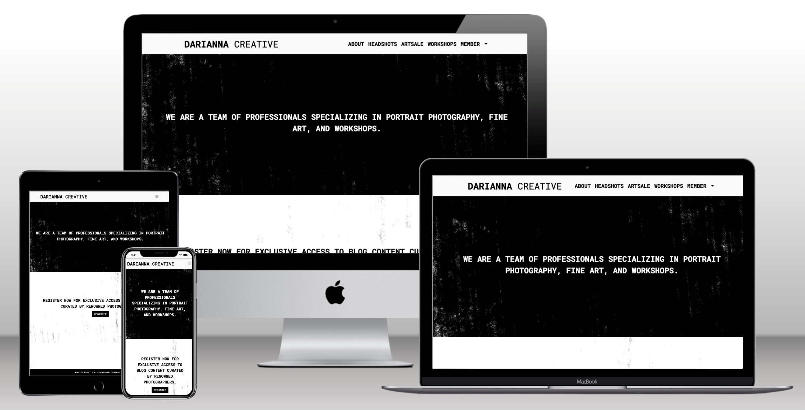
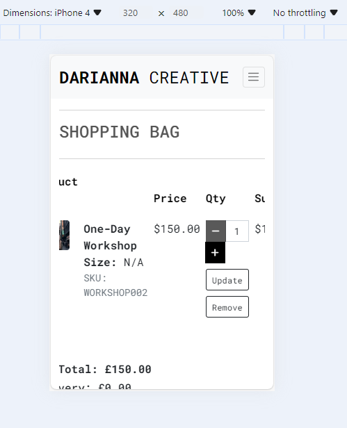

# Project Testing

[DaRianna Creative](https://darianna-creative-29127b71c835.herokuapp.com/) 

# Table of Contents

- [Project Testing](#project-testing)
  - [Manual Testing](#manual-testing)
  - [Validation checks](#validation-checks)
    - [W3C HTML](#w3c-html)
    - [CSS](#css)
    - [Javascript Validation](#javascript-validation)
    - [Python Validation](#python-validation)
    - [Stripe validation](#Stripe-Validation)
  - [Lighthouse validations](#lighthouse-validations)
  - [Responsivness validations](#responsivness-validations)
  - [User Story Testing](#user-story-testing)

## Manual Testing

Manual testing is crucial in website development, providing unique advantages that automated testing cannot. Human testers bring intuition, creativity, and adaptability, identifying user experience issues that may go unnoticed. Manual testing is particularly useful in exploratory testing and UI/UX evaluation. Combining manual and automated testing leads to high-quality products. 
Manual testing has been undertaken for the Darianna Creative website. Below is the summary of the steps and results.

## About page

| Test Case      | Description                                    | Steps                                             | Expected Result                                     | Pass/Fail | Comment                                          |
|----------------|------------------------------------------------|---------------------------------------------------|-----------------------------------------------------|-----------|--------------------------------------------------|
| Navigation     | Check if navigation links are working          | 1. Click on the logo                              | Redirected to the About (home) page                | Pass      |                                                  |
|                |                                                | 2. Click on "Headshots" link                      | Redirected to the Headshots page                   | Pass      |                                                  |
|                |                                                | 3. Click on "Artsale" link                        | Redirected to the Artsale page                     | Pass      |                                                  |
|                |                                                | 4. Click on "Workshops" link                      | Redirected to the Workshops page                   | Pass      |                                                  |
|                |                                                | 5. Click on "Blog" link                           | Redirected to the Blog page                        | Pass      |                                                  |
|                |                                                | 6. Click on "Profile" link                        | Redirected to the Profile page                     | Pass      |                                                  |
|                |                                                | 7. Click on "Product Administration" link         | Redirected to the Product Administration page      | Pass      |                                                  |
| About Page     | Check the content and layout of the About page | 1. Verify the presence of the welcome messages    | Welcome messagges are displayed | Pass      |                                                  |
|                |                                                | 2. Verify the "Registration" button                  | Button is present and clickable                   | Pass      |                                                  |
| Flash Messages | Check if flash messages are displayed         | - No specific steps, just observe the flash messages | Flash messages (if any) are displayed            | Pass      | No messages displayed as expected                |
| Footer         | Check the content and layout of the footer    | - No specific steps, just observe the footer      | Footer contains the helper message                | Pass      |                                                  |
| Responsive    | Check if the page is responsive               | - Resize the browser window                       | Page content adjusts appropriately for different screen sizes | Pass      |                                                  |
| Accessibility | Check if the page is accessible              | - Use a screen reader                             | No accessibility issues are reported             | Pass      |                                                  |

## Headshots page

| Test Case          | Description                                           | Steps                                             | Expected Result                                | Pass/Fail | Comment                                  |
|--------------------|-------------------------------------------------------|---------------------------------------------------|------------------------------------------------|-----------|------------------------------------------|
| Navigation         | Check if navigation links are working                 | 1. Click on the logo                             | Redirected to the About (home) page           | Pass      |                                          |
|                    |                                                       | 2. Click on "Headshots" link                     | Redirected to the Headshots page              | Pass      |                                          |
|                    |                                                       | 3. Click on "Artsale" link                       | Redirected to the Artsale page                | Pass      |                                          |
|                    |                                                       | 4. Click on "Workshops" link                     | Redirected to the Workshops page              | Pass      |                                          |
|                    |                                                       | 5. Click on "Blog" link                          | Redirected to the Blog page                   | Pass      |                                          |
|                    |                                                       | 6. Click on "Profile" link                       | Redirected to the Profile page                | Pass      |                                          |
|                    |                                                       | 7. Click on "Product Administration" link        | Redirected to the Product Administration page | Pass      |                                          |
| Headshots Page     | Check the content and layout of the page             | 1. Verify the presence of the displayed product | Porducts are displayed                | Pass      |                                          |
|                    |                                                       | 2. Verify the Product "View" button                      | Button is present and clickable               | Pass      |                                          |
| Flash Messages     | Check if flash messages are displayed                | - No specific steps, just observe the flash messages | Flash messages (if any) are displayed     | Pass      | No messages displayed as expected      |
| Footer             | Check the content and layout of the footer           | - No specific steps, just observe the footer    | Footer contains the helper message            | Pass      |                                          |
| Responsive         | Check if the page is responsive                      | - Resize the browser window                      | Page content adjusts appropriately for different screen sizes | Pass      |                                          |
| Accessibility      | Check if the page is accessible                     | - Use a screen reader                            | No accessibility issues are reported          | Pass      |                                          |

## Artsale page

| Test Case      | Description                                    | Steps                                             | Expected Result                                     | Pass/Fail | Comment                                          |
|----------------|------------------------------------------------|---------------------------------------------------|-----------------------------------------------------|-----------|--------------------------------------------------|
| Navigation     | Check if navigation links are working          | 1. Click on the logo                              | Redirected to the About (home) page                | Pass      |                                                  |
|                |                                                | 2. Click on "Headshots" link                      | Redirected to the Headshots page                   | Pass      |                                                  |
|                |                                                | 3. Click on "Artsale" link                        | Redirected to the Artsale page                     | Pass      |                                                  |
|                |                                                | 4. Click on "Workshops" link                      | Redirected to the Workshops page                   | Pass      |                                                  |
|                |                                                | 5. Click on "Blog" link                           | Redirected to the Blog page                        | Pass      |                                                  |
|                |                                                | 6. Click on "Profile" link                        | Redirected to the Profile page                     | Pass      |                                                  |
|                |                                                | 7. Click on "Product Administration" link         | Redirected to the Product Administration page      | Pass      |                                                  |
| Headshots Page | Check the content and layout of the page       | 1. Verify the presence of the displayed product   | Porducts are displayed                      | Pass      |                                                  |
|                |                                                | 2. Verify the "View" button                        | Buttons are present and clickable                   | Pass      |                                                  |
| Flash Messages | Check if flash messages are displayed         | - No specific steps, just observe the flash messages | Flash messages (if any) are displayed            | Pass      | No messages displayed as expected                |
| Footer         | Check the content and layout of the footer    | - No specific steps, just observe the footer      | Footer contains the helper message                | Pass      |                                                  |
| Responsive    | Check if the page is responsive               | - Resize the browser window                       | Page content adjusts appropriately for different screen sizes | Pass      |                                                  |
| Accessibility | Check if the page is accessible              | - Use a screen reader                             | No accessibility issues are reported             | Pass      |                                                  |

## Workshops page

| Test Case      | Description                                    | Steps                                             | Expected Result                                | Pass/Fail | Comment                                   |
|----------------|------------------------------------------------|---------------------------------------------------|------------------------------------------------|-----------|-------------------------------------------|
| Navigation     | Check if navigation links are working          | 1. Click on the logo                              | Redirected to the About (home) page           | Pass      |                                           |
|                |                                                | 2. Click on "Headshots" link                      | Redirected to the Headshots page              | Pass      |                                           |
|                |                                                | 3. Click on "Artsale" link                        | Redirected to the Artsale page                | Pass      |                                           |
|                |                                                | 4. Click on "Workshops" link                      | Redirected to the Workshops page              | Pass      |                                           |
|                |                                                | 5. Click on "Blog" link                           | Redirected to the Blog page                   | Pass      |                                           |
|                |                                                | 6. Click on "Profile" link                        | Redirected to the Profile page                | Pass      |                                           |
|                |                                                | 7. Click on "Product Administration" link         | Redirected to the Product Administration page | Pass      |                                           |
| Workshops Page | Check the content and layout of the page       | 1. Verify the presence of the displayed product   | Porducts are displayed                | Pass      |                                           |
|                |                                                | 2. Verify the "View" buttons                      | Buttons are present and clickable               | Pass      |                                           |
| Flash Messages | Check if flash messages are displayed         | - No specific steps, just observe the flash messages | Flash messages (if any) are displayed      | Pass      | No messages displayed as expected       |
| Footer         | Check the content and layout of the footer    | - No specific steps, just observe the footer      | Footer contains the helper message           | Pass      |                                           |
| Responsive    | Check if the page is responsive               | - Resize the browser window                       | Page content adjusts appropriately for different screen sizes | Pass      |                                           |
| Accessibility | Check if the page is accessible              | - Use a screen reader                             | No accessibility issues are reported         | Pass      |                                           |

## Blog page

| Test Case         | Description                                    | Steps                                                 | Expected Result                                | Pass/Fail | Comment                                   |
|-------------------|------------------------------------------------|-------------------------------------------------------|-----------------------------------------------|-----------|-------------------------------------------|
| Navigation        | Check if navigation links are working          | 1. Click on the logo                                 | Redirected to the About (home) page           | Pass      |                                           |
|                   |                                                | 2. Click on "Headshots" link                         | Redirected to the Headshots page              | Pass      |                                           |
|                   |                                                | 3. Click on "Artsale" link                           | Redirected to the Artsale page                | Pass      |                                           |
|                   |                                                | 4. Click on "Workshops" link                         | Redirected to the Workshops page              | Pass      |                                           |
|                   |                                                | 5. Click on "Blog" link                              | Redirected to the Blog page                   | Pass      |                                           |
|                   |                                                | 6. Click on "Profile" link                           | Redirected to the Profile page                | Pass      |                                           |
|                   |                                                | 7. Click on "Product Administration" link            | Redirected to the Product Administration page | Pass      |                                           |
| Blog Page         | Check the content and layout of the page       | 1. Verify the presence of the welcome messages       | Welcome message is displayed                  | Pass      |                                           |
|                   |                                                | 2. Verify the blog content is displayed              | Blog content is displayed                     | Pass      |                                           |
| Flash Messages    | Check if flash messages are displayed         | - No specific steps, just observe the flash messages | Flash messages (if any) are displayed         | Pass      | No messages displayed as expected       |
| Footer            | Check the content and layout of the footer    | - No specific steps, just observe the footer         | Footer contains the helper message           | Pass      |                                           |
| Responsive       | Check if the page is responsive               | - Resize the browser window                          | Page content adjusts appropriately for different screen sizes | Pass |                                           |
| Accessibility    | Check if the page is accessible              | - Use a screen reader                                | No accessibility issues are reported         | Pass      |                                           |

## Profile page

| Test Case         | Description                                    | Steps                                                 | Expected Result                                | Pass/Fail | Comment                                             |
|-------------------|------------------------------------------------|-------------------------------------------------------|-----------------------------------------------|-----------|-----------------------------------------------------|
| Navigation        | Check if navigation links are working          | 1. Click on the logo                                 | Redirected to the About (home) page           | Pass      |                                                     |
|                   |                                                | 2. Click on "Headshots" link                         | Redirected to the Headshots page              | Pass      |                                                     |
|                   |                                                | 3. Click on "Artsale" link                           | Redirected to the Artsale page                | Pass      |                                                     |
|                   |                                                | 4. Click on "Workshops" link                         | Redirected to the Workshops page              | Pass      |                                                     |
|                   |                                                | 5. Click on "Blog" link                              | Redirected to the Blog page                   | Pass      |                                                     |
|                   |                                                | 6. Click on "Profile" link                           | Redirected to the Profile page                | Pass      |                                                     |
|                   |                                                | 7. Click on "Product Administration" link            | Redirected to the Product Administration page | Pass      |                                                     |
| Profile Page      | Check the content and layout of the page       | 1. Verify the presence of the page name in the heading | The page name is present                      | Pass      |                                                     |
|                   |                                                | 2. Verify the user details form is present            | The user details form is present              | Pass      |                                                     |
|                   |                                                | 3. Verify the Update Information button submits details | The Update button submits details on click   | Pass      |                                                     |
|                   |                                                | 4. Verify the Order history is displayed             | The user order history is present            | Pass      |                                                     |
| Flash Messages    | Check if flash messages are displayed         | - No specific steps, just observe the flash messages | Flash messages (if any) are displayed         | Pass      | Flash message is displayed to inform the profile has been updated successfully |
| Footer            | Check the content and layout of the footer    | - No specific steps, just observe the footer         | Footer contains the helper message           | Pass      |                                                     |
| Responsive       | Check if the page is responsive               | - Resize the browser window                          | Page content adjusts appropriately for different screen sizes | Pass |                                                     |
| Accessibility    | Check if the page is accessible              | - Use a screen reader                                | No accessibility issues are reported         | Pass      |                                                     |

## Administration page

| Test Case            | Description                                      | Steps                                                     | Expected Result                                       | Pass/Fail | Comment                                                     |
|----------------------|--------------------------------------------------|-----------------------------------------------------------|-------------------------------------------------------|-----------|-------------------------------------------------------------|
| Navigation           | Check if navigation links are working            | 1. Click on the logo                                      | Redirected to the About (home) page                   | Pass      |                                                             |
|                      |                                                  | 2. Click on "Headshots" link                              | Redirected to the Headshots page                      | Pass      |                                                             |
|                      |                                                  | 3. Click on "Artsale" link                                | Redirected to the Artsale page                        | Pass      |                                                             |
|                      |                                                  | 4. Click on "Workshops" link                              | Redirected to the Workshops page                      | Pass      |                                                             |
|                      |                                                  | 5. Click on "Blog" link                                   | Redirected to the Blog page                           | Pass      |                                                             |
|                      |                                                  | 6. Click on "Profile" link                                | Redirected to the Profile page                        | Pass      |                                                             |
|                      |                                                  | 7. Click on "Product Administration" link                 | Redirected to the Product Administration page          | Pass      |                                                             |
| Administration Page  | Check the content and layout of the page         | 1. Verify the presence of the page name in the heading     | The page name is present                              | Pass      |                                                             |
|                      |                                                  | 2. Verify the Add Product form is present                  | The Add product form is present                       | Pass      |                                                             |
|                      |                                                  | 3. Verify the Add Product button submits/add details        | The Add product submits details on click              | Pass      |                                                             |
| Flash Messages       | Check if flash messages are displayed           | - No specific steps, just observe the flash messages        | Flash messages (if any) are displayed                | Pass      | Flash message is displayed to inform the product has been added successfully |
| Footer               | Check the content and layout of the footer      | - No specific steps, just observe the footer               | Footer contains the helper message                   | Pass      |                                                             |
| Responsive           | Check if the page is responsive                 | - Resize the browser window                                | Page content adjusts appropriately for different screen sizes | Pass |                                                             |
| Accessibility        | Check if the page is accessible                | - Use a screen reader                                      | No accessibility issues are reported                 | Pass      |                                                             |

## Shopping bag page

| Test Case               | Description                                          | Steps                                                         | Expected Result                                     | Pass/Fail | Comment                                                                                                                                                  |
|-------------------------|------------------------------------------------------|---------------------------------------------------------------|-----------------------------------------------------|-----------|----------------------------------------------------------------------------------------------------------------------------------------------------------|
| Navigation              | Check if navigation links are working                | 1. Click on the logo                                           | Redirected to the About (home) page                | Pass      |                                                                                                                                                          |
|                         |                                                      | 2. Click on "Headshots" link                                   | Redirected to the Headshots page                   | Pass      |                                                                                                                                                          |
|                         |                                                      | 3. Click on "Artsale" link                                     | Redirected to the Artsale page                     | Pass      |                                                                                                                                                          |
|                         |                                                      | 4. Click on "Workshops" link                                   | Redirected to the Workshops page                   | Pass      |                                                                                                                                                          |
|                         |                                                      | 5. Click on "Blog" link                                        | Redirected to the Blog page                        | Pass      |                                                                                                                                                          |
|                         |                                                      | 6. Click on "Profile" link                                     | Redirected to the Profile page                     | Pass      |                                                                                                                                                          |
|                         |                                                      | 7. Click on "Product Administration" link                      | Redirected to the Product Administration page       | Pass      |                                                                                                                                                          |
| Shopping Bag Page       | Check the content and layout of the page             | 1. Verify the presence of the page name in the heading          | The page name is present                           | Pass      |                                                                                                                                                          |
|                         |                                                      | 2. Verify added products are present                           | Added products are listed                          | Pass      |                                                                                                                                                          |
|                         |                                                      | 3. Verify the Add Product button submits/add details            | The Add product submits details on click           | Pass      |                                                                                                                                                          |
|                         | Check Price and subtotal                            | 1. Check product price is displayed                            | The product price is displayed                     | Pass      |                                                                                                                                                          |
|                         |                                                      | 2. Check Subtotal corresponds to the Quantity * Price            | The subtotal is as per the quantity * price        | Pass      |                                                                                                                                                          |
|                         | Check the quantity increase/decrease               | 1. Check if Plus button increases the quantity of the product   | The plus button increases number by one            | Pass      |                                                                                                                                                          |
|                         |                                                      | 2. Check if Minus button decreases the quantity of the product  | The plus button decreases number by one            | Pass      |                                                                                                                                                          |
|                         | Check the Update Quantity button                   | 1. Click on the "Update" button                                 | The subtotal increases/decreases to reflect the number of products | Pass |                                                                                                                                                          |
|                         | Check the Remove product button                    | 1. Click on the "Remove" button                                 | The product price is removed from the shopping list | Pass                                                |                                                                                                                                                          |
| Flash Messages          | Check if flash messages are displayed              | - No specific steps, just observe the flash messages              | Flash messages (if any) are displayed              | Pass      | No messages displayed as expected                                                                                                                        |
| Footer                  | Check the content and layout of the footer         | - No specific steps, just observe the footer                      | Footer contains the helper message                 | Pass      |                                                                                                                                                          |
| Responsive              | Check if the page is responsive                    | - Resize the browser window                                      | Page content adjusts appropriately for different screen sizes | Pass | The content is responsive but not to the standard. The to-do task was added to the Projects on GitHub to redesign the shopping bag to make it more user-friendly and presentable. |
| Accessibility           | Check if the page is accessible                   | - Use a screen reader                                            | No accessibility issues are reported               | Pass      |                                                                                                                                                          |

### Product detail page

| Test Case      | Description                                                  | Steps                                                      | Expected Result                                         | Pass/Fail | Comment |
|----------------|--------------------------------------------------------------|------------------------------------------------------------|---------------------------------------------------------|-----------|---------|
| Navigation     | Check if navigation links are working                        | 1. Click on the logo                                       | Redirected to the About (home) page                    | Pass      |         |
|                |                                                              | 2. Click on "Headshots" link                               | Redirected to the Headshots page                       | Pass      |         |
|                |                                                              | 3. Click on "Artsale" link                                  | Redirected to the Artsale page                          | Pass      |         |
|                |                                                              | 4. Click on "Workshops" link                                | Redirected to the Workshops page                        | Pass      |         |
|                |                                                              | 5. Click on "Blog" link                                     | Redirected to the Blog page                             | Pass      |         |
|                |                                                              | 6. Click on "Profile" link                                  | Redirected to the Profile page                          | Pass      |         |
|                |                                                              | 7. Click on "Product Administration" link                   | Redirected to the Product Administration page           | Pass      |         |
| Product detail | Check the content and layout of the page                    | 1. Verify the presence of the product card                 | The product card is displayed                          | Pass      |         |
|                |                                                              | 2. Verify the details of the card                           | The details include Title, Content, Rating, Price, Size (if Any), Quantity Adjuster, Navigation links to "Keep Shopping" and "Add to Bag" | Pass |         |
|                |                                                              | 3. User Admin - Verify Product Edit/Delete buttons          | Presence of the "Edit" and "Delete" buttons             | Pass      |         |
|                |                                                              | 4. User not Admin - Verify Product Edit/Delete buttons      | "Edit" and "Delete" buttons are not present             | Pass      |         |
|                |                                                              | 5. Verify the presence of the Reviews panel                 | Review Panel is present with the name of the product matching the Title of the product and displays "Add Review" button | Pass |         |
|                |                                                              | 6. Verify the presence of the Reviews (if any)              | Reviews details include Author Username, Date posted, Rating (0 to 5), Review Title, Review Content | Pass |         |
|                |                                                              | 7. User Admin - Verify the presence of Review Delete button | The review "Delete" button shall be displayed under each review (if any) | Pass |         |
|                |                                                              | 8. User not Admin and not Author of the review - Verify the presence of review "Edit/Delete" buttons | The review "Edit&Delete" buttons shall not be displayed under each review (if any) | Pass |         |
|                |                                                              | 9. User not Admin but Author of the review - Verify the presence of review "Edit/Delete" buttons | The review "Edit&Delete" buttons shall be displayed under each review (if any) | Pass |         |
|                | User Admin - Check the Product "Edit" button                | 1. Click on the "Update" button                             | The button redirects to the "Product Edit" page         | Pass      | The "Product edit" form displays and updates the product details as expected |
|                | User Admin - Check the "Delete" product button             | 1. Click on the "Delete" button                             | The product is deleted                                  | Pass      |         |
|                | User Author - Check the "Edit" button                      | 1. Click on the "Edit" button                               | The button redirects to the "Edit Review" page          | Pass      | The "Review edit" form displays and updates the review details as expected |
|                | User Author - Check the "Delete" button                    | 1. Click on the "Delete" button                             | The review is deleted                                    | Pass      |         |
|                | Check the quantity increase/decrease                        | 1. Click on Plus button to increase the quantity of the product | The plus button increase number by one                | Pass      |         |
|                |                                                              | 2. Clieck on Minus button to decrease the quantity of the product | The plus button decrease number by one                | Pass      |         |
|                | Check review Rating update                                  | 1. Check the review rating is updated if rating increased/decreased on update or Deleted | The product rating shall decrease if product deleted or rating decreased on update; and rating increased if on update rating was increased | Pass |         |
|                |                                                              | 2. Check Subtotal corresponds to the Quantity * Price        | The subtotal is as per the quantity * price             | Pass      |         |
|                | Check "Keep Shopping" buttons                               | 1. Click on the "Keep Shopping" button                      | Redirected back to the Products page                    | Pass      |         |
|                | Check "Add to Bag" buttons                                  | 1. Click on the "Add to Bag" button                         | Add product to the Bag                                  | Pass      |         |
| Flash Messages | Check if flash messages are displayed                       | - No specific steps, just observe the flash messages        | Flash messages (if any) are displayed                   | Pass      | During tests flash messages are displayed: Review Added, Review Successfully deleted, Review Successfully edited according to the test type |
| Footer         | Check the content and layout of the footer                 | - No specific steps, just observe the footer                | Footer contains the helper message                      | Pass      |         |
| Responsive     | Check if the page is responsive                             | - Resize the browser window                                | Page content adjusts appropriately for different screen sizes | Pass      |         |
| Accessibility  | Check if the page is accessible                             | - Use a screen reader                                      | No accessibility issues are reported                     | Pass      |         |

## Checkout Page

| Test Case          | Description                                                        | Steps                                                                       | Expected Result                                          | Pass/Fail | Comment                                                                                                                                             |
|--------------------|--------------------------------------------------------------------|-----------------------------------------------------------------------------|----------------------------------------------------------|-----------|-----------------------------------------------------------------------------------------------------------------------------------------------------|
| Navigation         | Check if navigation links are working                              | 1. Click on the logo                                                       | Redirected to the About (home) page                     | Pass      |                                                                                                                                                    |
|                    |                                                                    | 2. Click on "Headshots" link                                               | Redirected to the Headshots page                        | Pass      |                                                                                                                                                    |
|                    |                                                                    | 3. Click on "Artsale" link                                                 | Redirected to the Artsale page                          | Pass      |                                                                                                                                                    |
|                    |                                                                    | 4. Click on "Workshops" link                                               | Redirected to the Workshops page                        | Pass      |                                                                                                                                                    |
|                    |                                                                    | 5. Click on "Blog" link                                                    | Redirected to the Blog page                             | Pass      |                                                                                                                                                    |
|                    |                                                                    | 6. Click on "Profile" link                                                 | Redirected to the Profile page                          | Pass      |                                                                                                                                                    |
|                    |                                                                    | 7. Click on "Product Administration" link                                  | Redirected to the Product Administration page           | Pass      |                                                                                                                                                    |
| Checkout page      | Check the content and layout of the page                           | 1. Verify the presence of the page name in the heading                      | The page name is present                                 | Pass      |                                                                                                                                                    |
|                    |                                                                    | 2. Verify the Add Shipping addres and Card details form is present         | The User Details and Payment form is present            | Pass      |                                                                                                                                                    |
|                    |                                                                    | 3. Verify the the presence of "Adjust Bag" and "Complete Order" buttons   | The buttons are displayed below the form                | Pass      |                                                                                                                                                    |
|                    |                                                                    | 4. Verify the presence of the order summary                                 | The order summary is displayed on the page              | Pass      |                                                                                                                                                    |
| Check "Adjust Bag" button | 1. Click on the "Adjust Bag" button                             | Redirected to the Bag page                                                  | Pass                                                     | Pass      |                                                                                                                                                    |
| Check "Complete Order" button | 1. Click on the "Complete Order" button                         | Complete the order                                                          | Pass                                                     | Pass      |                                                                                                                                                    |
| Flash Messages     | Check if flash messages are displayed                             | - No specific steps, just observe the flash messages                        | Flash messages (if any) are displayed                    | Pass      | The flash message is displayed once the order is complete, informing the order has been placed successfully and an email confirmation sent to the provided email address. |
| Footer             | Check the content and layout of the footer                         | - No specific steps, just observe the footer                                | Footer contains the helper message                       | Pass      |                                                                                                                                                    |
| Responsive         | Check if the page is responsive                                   | - Resize the browser window                                                 | Page content adjusts appropriately for different screen sizes | Pass      |                                                                                                                                                    |
| Accessibility      | Check if the page is accessible                                   | - Use a screen reader                                                       | No accessibility issues are reported                    | Pass      |                                                                                                                                                    |

### Login Page
 

| Test Case | Description                        | Steps                                       | Expected Result                              | Pass/Fail | Comment                        |
|-----------|------------------------------------|---------------------------------------------|----------------------------------------------|-----------|--------------------------------|
| Log In    | Check if the login form works       | 1. Open the login page                      | Form is displayed with username and password fields | Pass      |                                |
|           |                                    | 2. Enter valid username and password      | User is redirected to the home or profile page (depending on the application) | Pass      |                                |
|           |                                    | 3. Leave either username or password blank and submit | Error message is displayed, and form is not submitted | Pass      |                                |
|           |                                    | 4. Enter an invalid username or password and submit | Error message is displayed, and form is not submitted | Pass      |                                |
| Responsive| Check if the page is responsive    | - Resize the browser window                 | Page content adjusts appropriately for different screen sizes | Pass      |                                |
| Accessibility| Check if the page is accessible  | - Use a screen reader | No accessibility issues are reported       | Pass      |                                |
| Registration| Check if the "Create Account" link works | 1. Click on the "Create Account" link   | User is redirected to the registration page | Pass      |                                |
|           |                                    | 2. Verify the presence of the registration form | Registration form is displayed               | Pass      |                                |

### Registration Page
 

| Test Case | Description                        | Steps                                       | Expected Result                              | Pass/Fail | Comment                        |
|-----------|------------------------------------|---------------------------------------------|----------------------------------------------|-----------|--------------------------------|
| Register  | Check if the registration form works | 1. Open the registration page              | Form is displayed with username and password fields | Pass      |                                |
|           |                                    | 2. Enter valid username and password      | User gets registred and is redirected to the login page | Pass      |                                |
|           |                                    | 3. Leave either username or password blank and submit | Error message is displayed, and form is not submitted | Pass      |                                |
|           |                                    | 4. Enter an invalid username or password and submit | Error message is displayed, and form is not submitted | Pass      |                                |
|           |                                    | 5. Enter existing username and submit | Error message is displayed, and form is not submitted | Pass      | A flash message is displayed, prompting the user to choose another username.                                 |
| Responsive| Check if the page is responsive    | - Resize the browser window                 | Page content adjusts appropriately for different screen sizes | Pass      |                                |
| Accessibility| Check if the page is accessible  | - Use a screen reader | No accessibility issues are reported       | Pass      |                                |
| Log In Link| Check if the "Log In" link works   | 1. Click on the "Log In" link               | User is redirected to the login page        | Pass      |                                |
|           |                                    | 2. Verify the presence of the login form    | Login form is displayed                      | Pass      |                                |

## Validation checks
### W3C HTML
[W3C HTML Validator](https://validator.w3.org/nu/) has been used to test HTML. TThe errors are consistent throughout. Element 
 is not allowed as a child of element ul in this context. The bug is booked to the GitHub project and will be rectified in future cycles. 
 

### Some examples for test setup

### CSS
[W3C CSS Validator](https://jigsaw.w3.org/css-validator/) has been used to test Cascading Style Sheets. The website has no errors.
 

### Some examples for test setup

### Javascript Validation
[ JSHint](https://jshint.com/) has been used to test javascript. The website has no errors.
 

### Some examples for test setup

### Python Validation
[ CI Python linter](https://pep8ci.herokuapp.com/) has been used to the Python files. The website has no errors.
 

### Some examples for test setup

### Stripe Validation
[ Stripe Webhooks](https://stripe.com/gb) has been used test Stripe connectivity and transaction. The website has no errors.
 

### Some examples for test setup

## Lighthouse validations 
Lighthouse testing across all pages reveals a common performance issue, primarily from the Largest Contentful Paint and unused javascript. While this impacts performance, it's currently deemed a low-priority concern. However, it's recommended that future improvement cycles review and optimize the form to enhance overall performance.

### Some examples for test setup

## Responsivness validations
The objective of this responsiveness test was to evaluate the website's performance and user interface across two distinct screen sizes – 1300px and 320px. The goal was to ensure that the website provides an optimal user experience on both larger desktop screens and smaller mobile screens.

Desktop (1300px):
Used Chomre DevOps browser developer tools to simulate a mobile screen with a width of 1300px.
Verified that all elements, including navigation menus, images, and text, are well-organized and proportionate.
Confirmed that the website layout scales appropriately, and content remains readable without horizontal scrolling.
Tested various pages, ensuring that all features and functionalities are accessible and perform as expected.

Mobile (320px):
Used Chomre DevOps browser developer tools to simulate a mobile screen with a width of 320px.
Checked the responsiveness of the website by confirming that the layout adjusts gracefully to the smaller screen.
Verified that navigation menus are accessible and user-friendly on mobile devices.
Ensured that images are appropriately resized and that text remains legible without requiring zooming.
Tested touch interactions, such as buttons and links, to ensure they respond effectively.
Checked for any overlapping or cut-off content on smaller screen

### Screen Size: 1300px

|                     | Website page     | About              | Headshots          | Artsale            | Workshops          | Blog               | Bag                | Checkout           | Login             | Register          |
|---------------------|------------------|--------------------|--------------------|--------------------|--------------------|--------------------|--------------------|--------------------|-------------------|-------------------|
| Check points        | Text clarity     | Ok                 | Ok                 | Ok                 | Ok                 | Ok                 | Ok                 | Ok                 | Ok                | Ok                |
|                     | Check Images layout | Ok              | Ok                 | Ok                 | Ok                 | Ok                 | Ok                 | Ok                 | Ok                | Ok                |
|                     | Rendering        | Ok                 | Ok                 | Ok                 | Ok                 | Ok                 | Ok                 | Ok                 | Ok                | Ok                |

### Screen Size: 320px

|                     | Website page     | About              | Headshots          | Artsale            | Workshops          | Blog               | Bag                | Checkout           | Login             | Register          |
|---------------------|------------------|--------------------|--------------------|--------------------|--------------------|--------------------|--------------------|--------------------|-------------------|-------------------|
| Check points        | Text clarity     | Ok                 | Ok                 | Ok                 | Ok                 | Issue              | Ok                 | Ok                 | Ok                | Ok                |
|                     | Check Images layout | Ok              | Ok                 | Ok                 | Ok                 | Issue              | Ok                 | Ok                 | Ok                | Ok                |
|                     | Rendering        | Ok                 | Ok                 | Ok                 | Ok                 | Issue              | Ok                 | Ok                 | Ok                | Ok                |

- **Shopping bag page:**
The layout of the Shopping Bag page on smaller screens is not user-friendly. The product details appear cramped and unappealing, negatively impacting the overall user experience.

### Some examples for test setup

 

## User Story Testing
As discussed in the [README Agile Development section](readme.md#AgileDevelopment), MVP focused on the Must-Have items only. Below is the test summary of all user stories. 
 

| User Story Number | Description | Priority Label | Test    | Comments                                                                                                                                    |
|-------------------|-------------|----------------|---------|---------------------------------------------------------------------------------------------------------------------------------------------|
| [#1](https://github.com/AleksandrAtr/darianna-creative/issues/1) | As a first-time visitor, I want to browse a gallery of fine art prints available for purchase to explore the artistic offerings of the photographer. | Must-Have | Pass    | The user story has been successfully completed as first-time visitors can now browse a gallery showcasing fine art prints available for purchase, enabling them to explore the artistic offerings of the photographer. |
| [#2](https://github.com/AleksandrAtr/darianna-creative/issues/2) | As a first-time visitor, I want to browse a gallery of fine art prints available for purchase, categorized by themes or genres. | Should-Have | N/A     | Future improvements                                                                                                                         |
| [#3](https://github.com/AleksandrAtr/darianna-creative/issues/3) | As a first-time visitor, I want to view detailed information about each fine art print, including high-resolution images, descriptions, dimensions, and pricing, to make informed purchasing decisions. | Must-Have | Pass    | The user story has been successfully completed as first-time visitors can now access detailed information about each fine art print, including high-resolution images, descriptions, dimensions, and pricing, empowering them to make informed purchasing decisions. |
| [#4](https://github.com/AleksandrAtr/darianna-creative/issues/4) | As a first-time visitor, I want to learn about the headshot services offered by the photographer, including packages available, pricing, and examples of previous work, to assess their suitability for my needs. | Must-Have | Pass    | The user story has been successfully completed as first-time visitors can now explore comprehensive information about the headshot services offered by the photographer, including available packages, pricing details, and examples of previous work, enabling them to assess the suitability of the services for their needs. |
| [#5](https://github.com/AleksandrAtr/darianna-creative/issues/5) | As a first-time visitor, I want to easily register for an account on the website, with a straightforward and intuitive process, to access additional features and benefits. | Must-Have | Pass    | The user story has been successfully completed as first-time visitors can now register for an account on the website through a straightforward and intuitive process, allowing them to access additional features and benefits with ease. |
| [#6](https://github.com/AleksandrAtr/darianna-creative/issues/6) | As a registered user, I want a personalized account dashboard where I can manage my profile information including deleting the account. | Should-Have | N/A     | Future improvements                                                                                                                         |
| [#7](https://github.com/AleksandrAtr/darianna-creative/issues/7) | As a registered user, I want access exclusive content to enhance my overall experience on the website. | Should-Have | N/A     | Future improvements                                                                                                                         |
| [#8](https://github.com/AleksandrAtr/darianna-creative/issues/8) | As a registered user, I want view order history. | Should-Have | N/A     | Future improvements                                                                                                                         |
| [#9](https://github.com/AleksandrAtr/darianna-creative/issues/9) | As a registered user, I want to save favourite prints for easy access in the future. | Must-Have | Ongoing | The following feature has not yet been completed but is suggested for future improvements: As a registered user, the ability to save favorite prints for easy access in the future. This enhancement would enhance user experience by allowing users to conveniently access and revisit their preferred prints without the need for repeated browsing. |
| [#10](https://github.com/AleksandrAtr/darianna-creative/issues/10) | As a registered user, I want to access the website's scheduling feature to view the available time slots for headshot sessions. | Must-Have | Ongoing | The following feature has not yet been completed but is suggested for future improvements: As a registered user, the ability to access the website's scheduling feature to view available time slots for headshot sessions. Implementing this feature would enhance user convenience by allowing users to efficiently plan and book headshot sessions according to their availability. |
| [#11](https://github.com/AleksandrAtr/darianna-creative/issues/11) | As a registered user, my goal is to seamlessly book a photo session by completing an online payment. | Could-Have | N/A     | Future improvements                                                                                                                         |
| [#12](https://github.com/AleksandrAtr/darianna-creative/issues/12) | As a registered user, I aim to purchase fine art prints conveniently by completing an online payment. | Must-Have | Pass    | The user story has been successfully completed as registered users can now conveniently purchase fine art prints by completing an online payment, streamlining the purchasing process and enhancing user satisfaction. |
| [#13](https://github.com/AleksandrAtr/darianna-creative/issues/13) | As a registered user, I want to receive regular updates and notifications about new fine art prints, special offers, and upcoming photo sessions to stay informed about the photographer's latest offerings and promotions. | Should-Have | N/A     | Future improvements                                                                                                                         |
| [#14](https://github.com/AleksandrAtr/darianna-creative/issues/14) | As a first-time user, I aim to purchase fine art prints conveniently by completing an online payment. | Must-Have | Pass    | The user story has been successfully completed as first-time users can now conveniently purchase fine art prints by completing an online payment, providing a seamless and efficient purchasing experience. |
| [#15](https://github.com/AleksandrAtr/darianna-creative/issues/15) | As a first-time visitor, I want to access the website's scheduling feature to view the time slots for headshot sessions. | Must-Have | Pass    | Same as No 10 (bug)                                                                                                                         |
| [#16](https://github.com/AleksandrAtr/darianna-creative/issues/16) | As a registered user, my goal is to seamlessly book a photo session by completing an online payment. | Must-Have | Pass    | The user story has been successfully completed as registered users can now seamlessly book a photo session by completing an online payment, ensuring a smooth and efficient booking process. |
| [#17](https://github.com/AleksandrAtr/darianna-creative/issues/17) | As an admin, I want to have access to a comprehensive content management system where I can easily add, edit, or remove fine art prints, headshot packages, and photo session options, to keep the website's offerings up-to-date and relevant. | Should-Have | N/A     | Future improvements                                                                                                                         |
| [#18](https://github.com/AleksandrAtr/darianna-creative/issues/18) | As an admin, I want to be able to manage user accounts, including approving registrations, updating account status, and addressing any user inquiries or issues, to ensure a smooth and efficient user experience. | Must-Have | Pass    | The user story has been successfully completed as administrators can now manage user accounts, including approving registrations, updating account status, and addressing any user inquiries or issues, ensuring a smooth and efficient user management process. |
| [#19](https://github.com/AleksandrAtr/darianna-creative/issues/19) | As an admin, I want to have access to analytics and reporting tools to track website traffic, user engagement, sales performance, and other key metrics, to make informed decisions and optimize the website's performance and offerings. | Should-Have | N/A     | Future improvements                                                                                                                         |
| [#20](https://github.com/AleksandrAtr/darianna-creative/issues/20) | As a first-time visitor, I want to easily discover the services or products offered on the website. | Must-Have | Pass    | The user story has been successfully completed as first-time visitors can now easily discover the services or products offered on the website, enhancing their browsing experience and enabling them to quickly find what they are looking for. |

